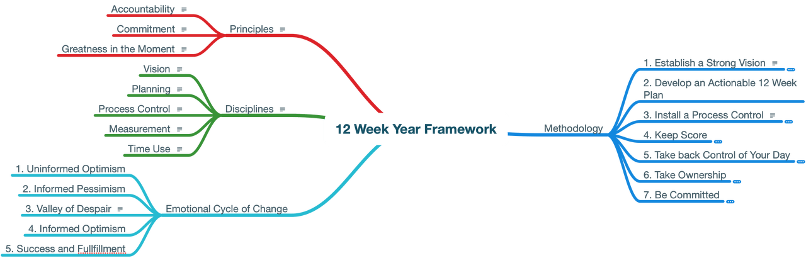
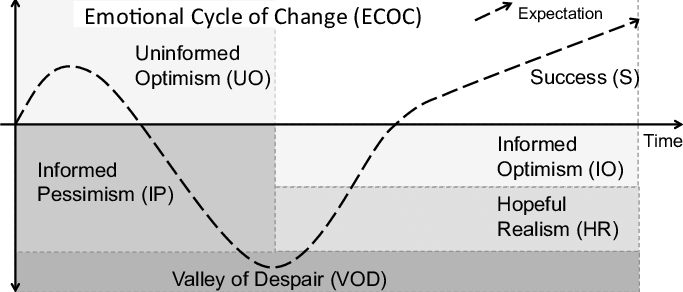
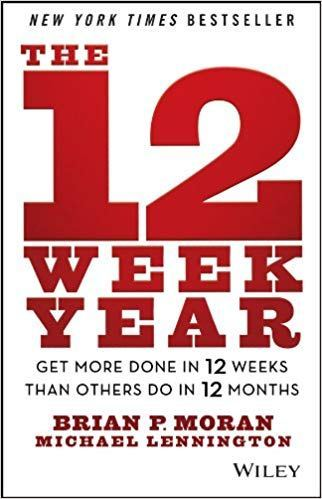

Dear friends,

It’s really hard to summarize the [12 Week Year framework](https://amzn.to/2MqrxZe) because it’s a very rich productivity framework. I have the feeling that any summarization will skip a lot of useful information. So I’ll only highlight general concepts and actionable tips. I’ll provide at the end of the post a "Mind Map" with key information about the framework.

## tl;dr

- Consider a year as having 12 weeks instead of 52
- Be ambitious about the life you want to live in
- Capture in plans what needs to be done so you can achieve your dream life, in 2/5/10 years goals
- List actions you need to take to achieve your first 2 years goals
- Among that actions, what do you need to do this year (year = 12 weeks)?
- Define then a weekly schedule of all actions you need to perform to move toward your goals
- Commit on doing the things you planned to do
- Stay accountable to your daily and weekly achievements. Celebrate if you succeeded, understand the causes of your failures, then take actions accordingly
- Share your progress to stay motivated

## Principles and Disciplines

Like every productivity framework, the 12 Week Year is built around 3 principles and 5 disciplines.

The principles are **Accountability** (you are the master of your life, you can’t control the context/environment around you, but you can control how you react to them), **Commitment** (you take it as personal to do what you said you’ll be doing) and **Greatness in the Moment** (no matter what, you’re at your best in every moment). As you can see, it might seem "naïve" to think that you can really respect that principles at all time, no matter what. After all, we are humans, with highs and lows. But like every principle, not trying because it’s hard is not a valid excuse. We must be pragmatic and try our best to respect that three principles.

Disciplines, in the 12 Week Year framework, are **Vision** (define a clear and compelling vision), **Planning** (anticipate as much as possible), **Process Control** (the system that you create to get important stuff done), **Measurement** (always track your progress) and **Time Use** (are you in control of your time?). These disciplines are skills that need to be mastered, no matter if you adhere to the 12 Week Year framework, or not. They are proven skills for every person willing to be productive.

## Emotional Cycle of Change

One fun chapter was about the Emotional Cycle of Change (Kelly and Connor 1979).

In short, when we envision the life we want to achieve, we experience an "Uninformed Optimism" state of mind. We feel very excited and can’t wait to start working toward our dreams. We might feel that state for few days, but the more we have a clear view on the obstacles, the harder achieving our goals feels. That’s the "Informed Pessimism" phase. Continuing into that project, we end up reaching the "Valley of Despair". That’s the most depressing phase, where we feel desperate reaching our goal one day. It’s so intens, that stopping everything and going back to our previous phase looks very tempting, since it’s easier to give up than keep feeling this pain. Here is where most people give up.

The good news is that if we keep working relentlessly to achieve our goal, if we have a compelling vision on our success, and the right system to keep working, things will get better, and we start feeling "Informed Optimism" phase. We know we are moving into the right direction, and we have a cleaner view about what is still to come and how to tackle obstacles. "Success" is the final state we feel, since we finally achieved our goals.

ECOC os a general concept, and if you think about it, we all felt all of the 4 phases, during our studies, personal or professional lifes. 2 take aways must be taken:

- Always be aware of the ECOC, so you can aknowledge why you feel bad, and that you must keep going
- The hardest phase (Valley of Despair) can only be crossed if you have a strong vision about what you want to achieve, including "Why" you want to see this vision becomes true

## Methodology

### Establish a Strong Vision

Planning takes a big part of the framework at the beginning. You must envision the life you want to have in the future, considering all aspects (personal, professional, wealth, spirituality, …) Having a bold vision will help you boost motivation when things get tough (remember the "Valley of Despair").

You must then decline it into short-, mid- and long-term goals that will help achieve that life. Do not start answering the "How" question, but "What I want to accomplish?"

### Develop an Actionable 12 Week Plan

Now that you have a short-term goal (2 or 3 years from now), what are the intermediary steps to reach that goal? Given that now, 1 year is 12 weeks, what are the most important things to achieve the next 12 weeks, then the next 12, and so on.

Plans must be actionable. This means that you now have a clear set of actions that you will acheive on a daily and/or weekly basis.

How to reach your vision can be vague, your intermediary plans should set flags toward your vision, but your 12 week plans must be pragmatic on what actions you need to perform and master so you can be closer to your vision in 12 weeks, than you are today.

### Install a Process Control

Be like a machine. Define clear, time-boxed actions, you must perform. This requires a shift in how we see productivity: Instead of thinking in term of goals, we think in term of systems that will help perform actions.

Weekly and daily plannings helps create systems to be a "doer". We not only know "we must do a thing", we know "when it will be done".

Process control also creates habits. Actions that must be done daily (like writing), are easier to achieve if we already reserved time slots for them. After few weeks, that hard to do actions will become routines.

### Keep Score

How can we know we are making progress if we don’t score our achievements vs. what must be done. The key here is, to be honest, in order score ourselves objectively. If we screw it up, it must be recorded honestly.

It’s OK to miss some actions. It’s not OK to not score properly, or worse not score at all. You are accountable to your future self, the one you envisioned.

### Take Back Control of Your Day

We already said that everything must be planned in advance. Don’t try to fill all your weekly time slots. Keep some "airs" in case something takes longer, or if you have some unexpected event.

No matter what, do your best to be the master of your time, or your time will be at the disposal of others.

### Take Ownership

Blaming circumstances and chance is easy, but it’s not helpful. We all have "out of control" circumstances, and no one can ever control them. But what we do control is our reaction to that circumstances.

### Be Committed

Do things. Really, if you planned action, and you reserved a moment to do it, then do it. You made promises to your future self, so you must keep your words, and even if it feels hard, or painful, or boring, you have no choice but to do it.

Otherwise, you will have to pay it, whether it be with extra effort, or with missing your goals.

## Weekly Accountability Meeting

One stressed notion on the 12 Week Year framework if the WAM (Weekly Accountability Meeting). A group of 3 to 5 people meeting (physically or via phone) to share their plans, progress, and encouragement.

This is an important part, because it increases the feeling of accountability, commitment, and help express doubts and seek for advices and encouragements. Achievement is a team work, no matter what, you’ll go further with others than you do alone. This is true in sport, but also professionally, and personnaly.

The reality is that I find it hard to meet with people if they don’t share the 12 Week Year components (principles, disciplines, methodology,…) I tried to reach with people via Reddit and Quora, but without success. **If you too are interested in creating a WAM, or are already a member of a WAM and looking for a new member, get in touch with me in the comments; I’m interested.**

## Conclusion

The 12 Week Year is not easy. It takes a lot of efforts: Break bad habits, have a bold vision, strategic planning, weekly/daily schedulings, commitments, scoring,…

I personally screwed my first 12 Week Year, but it’s OK. Now I have more confidence for my next iteration and a more clear vision on the path ahead. I might make some mistakes in the next one, but in all cases, I really feel the joy of making progress, and to finally feeling the sweetness of getting things done.

[Download 12 Week Year Mind Map, PDF format.](./12-Week-Year-mind-map-htaidirt.com.pdf)

