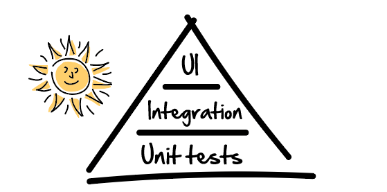

> Nota: This article was first published on Medium. You can read the exact same content [by following this link](https://medium.com/@htaidirt/strategic-testing-dd1980d1a59a).

## tl;dr

Take the time to think about what you want to test, and why you need to test it. Have a high level thinking and take the best solution given you constraints (time, resource, knowledge,…)

---

Dear friends,

As developers, when time comes to write tests, we tend to have one of the following attitudes:

1. We don’t write tests, or at least the minimum. After all, this is just a small app, there is no way it can fail, right?
2. We over test. Once that first unit or integration test is written, writing more tests is often a matter of copy/paste with just slight changes on the scenario and expected outcome. We even test correct logging.

This post is not about why you should write tests. It’s not titled _"The 10 reasons developers should write tests. Number 5 will blow your mind!"_. It’s about thinking which tests gives the highest return. How you should think before testing.

## It all starts with the pyramid

As Martin Fowler suggests in [his pyramid of tests](https://martinfowler.com/articles/practical-test-pyramid.html), there are three stages of testing:

1. **Unit tests.** They are base of the pyramid, the simplest tests we can write to check our coding. They relate to your developments and your boss doesn’t care about them! They also are the cheapest and fastest tests you can write. Examples include: Testing email format, and checking password SHA256 encryption.
2. **Integration/Service tests.** This is where you start thinking about functionalities. You start seeing high view objectives of your work. Now your email and password check should work together to allow/block users accessing their account. You now must test the nominal case, but also edge cases, like missing values, bad credentials, unreachable database,… etc.
3. **UI tests** is where you test how the user interact with your application. You simulate clicks and form fills. Your nice sign in page should now display a threatening error message in case of bad credentials. They are the hardest and longest tests to write. Mainly because they depend on your UI, which is subject to change over time.

Your tests will cover many aspects of your application, at different levels. But how to decide which tests you should focus on?

## What are your expected outcomes?

Why are you testing? Do you have a main purpose for your tests? Do you blindly follow test coverage stats to satisfy your ego or your manager? I personally made the mistake of chasing the 90% test coverage, and this didn’t prevent my application to miserably fail on production.

First, find out what can go wrong with this new feature. Can it break other features? Conflict with another class? Too much if/else statements?… Take the time to think about what can go wrong before even starting the first line of code. Many times, you realize that you first need to refactor something completely different in order to gracefully integrate your new feature.

Create a risk list, prioritize it, then write tests. In other words, have a test strategy.

The testing pyramid shows that integration tests provides the highest ROI for developers. They allow you to think about what your feature should do, and how it should behave given different use cases. One should probably start here defining application behaviors, then go deeper thinking about how to create the feature, using unit tests, and finally add some UI tests to ensure decent rendering.

Starting with integration tests will also help you structure your implementation. It seems hard at first, but thinking about how the application should respond to different use cases will show you the best direction to take when coding phase comes.

## If it can fail, it will fail

One solution is to write all kind of tests, and cover all possible scenarios. Again, we need to go back to the root and ask: "Why I need tests?"

Sad truth: Tests will not prevent your application to fail. It just gives you more confidence that it will not fail easily.

Because things will go bad one day or another, can you tell what are the worst case scenarios you want to avoid? Sure, your app is changing the world, so it’s your duty to make it work perfectly. This includes thinking about _"what could possibly go wrong?"_.

You can’t just think about a new feature in isolation. Because it needs to integrate with other parts of your solution, you also need to consider all possible scenarios. Three weapons you have:

1. **Have a high level overview.** Pretty self explanatory. Having a high level overview will help us anticipate how bad things can cascade and how to isolate the breach.
2. **Break things if necessary.** This is because we build our products in an incremental way, optimizing for a limited use, under limited assumptions. When we expand our horizon and consider new usage, our optimal product is not optimal at all, and adding a new feature is not just an add operation. We may reconsider our previous decisions, which may results in a "delete and restart" battle.
3. **Prioritize.** We are limited, no matter who we are. Given our limitations, our only hope is to prioritize what should be done. This really depends on the situation, but we must keep in mind that things will take time and are subject to change.

Talking about prioritization, my favorite tool is the [80/20 rule](https://en.wikipedia.org/wiki/Pareto_principle), also called the "law of the vital few". This can be a subject of an entire post (stay tuned), but to summarize, ask "which 20% of work can cover 80% of use?". In other words: Be lazy, and ask which 20% of efforts will cover 80% of results, and do them.

---

There is no unique way to think about how to test applications. This is a clear example of why coding is more an art than a science. Experience will play a huge role, and if you are a junior, learn from experts in your office, or [from the web](https://dev.tube/?q=test).

_What do YOU think?_

Regards.

