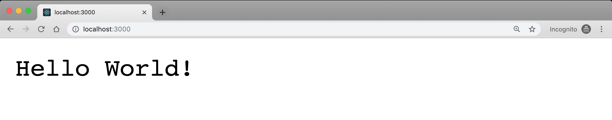
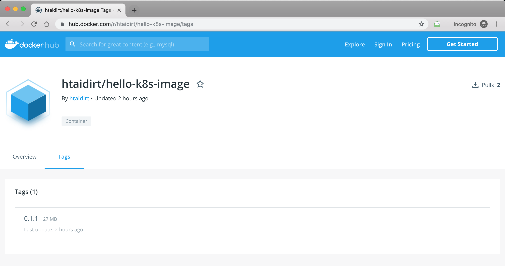

Hello World,

For long time, I considered Kubernetes to be the hardest technology I had to work with, and for long time, I avoided getting directly in touch with Kubernetes, and solely focus on development.

But I still remember the "aha moment" when this technology finally made sense for me. And I can really tell you (now that I have more experience using it): It's really not that hard.

In this little series, I'll try to give you your first experience creating a Kubernetes cluster on AWS, and deploy a basic Node.JS web application. I'll make the app really simple so you can focus on getting your hands dirty with Docker and Kubernetes.

This first post will prepare the ground for [part 2](../create-your-first-kubernetes-cluster-on-aws-part-2/), where we will dive head first in Kubernetes. But in this post, we are getting all what is necessary installed locally, and create the app with the Docker Image encapsulating it.

## 🎓 Goals

I'll consider this series successful if it helps you:

- Demystify Kubernetes
- Have basic knowledge on Kubernetes to keep the learning going
- Deploy your first Hello World app to a Kubernetes cluster on AWS

## 📚 Requirements for part 1

In order to easily follow the steps, you must have:

- **Basic understanding on Node.js**: We are building our app with Node.js, but you don't have to master the language to follow along. In fact, any language is fine, and you can surely do the same with your favorite programming language.
- **Basic knowledge of Docker**. Here again, just basic knowledge is required to follow along. Sure, you'll need deeper knowledge when deploying real world applications, but that's for another time.
- Following the previous requirement, you must have **Docker installed locally** and running. [Here you can find instructions](https://docs.docker.com/install/) on how to install Docker.
- A **Docker Hub account**. You can create a free Docker Hub account on [hub.docker.com](hub.docker.com).

Regarding Docker, I will assume you know what it is and how to work with, at least basic commands (creating a Dockerfile and a Docker image, running a container,... etc).

## 🐣 Basic web app

Yay, let's get started! To make things clear, create and go inside a new folder called **hello-k8s** (for example):

```bash
$ mkdir hello-k8s
$ cd hello-k8s
```

> Many times, Kubernetes is shortened into k8s, so don't be surprised if you find this shortcut somewhere else.

All our files will be in the root of this **hello-k8s** folder. With your favorite editor, create a **server.js** file with the following code:

```javascript
const http = require('http');

http.createServer((req, res) => {
    res.end('Hello World!');
}).listen(3000, () => {
    console.log('Go to http://localhost:3000');
});
```

In this little script, we create a server using the `http` package. This server always responds with text "Hello World!", and listens to port 3000.

To start the server, head back to your terminal and run:

```bash
$ node server.js
```

You should see the "Go to http://localhost:3000" message in the terminal. You can also check your web app by visiting _http://localhost:3000_ in your browser:



To shutdown the server, just _ctrl-c_ in your terminal.

So good so far. Our app can only be used locally for now, but we need to ship it to the world in form of a Docker image so anyone (authorized) can pull it and run it locally, or in any VM out there, including in public cloud providers like AWS and Google Cloud.

## 🐳 Dockerize the app

In the same directory as our **server.js** file, create a **Dockerfile** file that will encapsulate an environment (with Node.js) and the source code:

```Dockerfile
FROM node:12.9.1
EXPOSE 3000
COPY server.js .
CMD node server.js
```

In this Dockerfile, we decided to start with a _node:12.9.1_ image as a base environment. We also expose port 3000 because that's the port our server is listening to.

Then we copy the **server.js** file inside the image, and define the command to execute when the image gets booted (ie our container gets running).

Let's now "build" an image containing our application:

```bash
$ docker image build -t hello-k8s-image:0.1.0 .
```

This will create a _hello-k8s-image:0.1.0_ Docker image. We can list Docker images using:

```bash
$ docker image list

REPOSITORY              TAG                 IMAGE ID            CREATED             SIZE
hello-k8s-image         0.1.0               74030e2009ec        18 seconds ago      908MB
node                    12.9.1              fa0699832a2a        18 seconds ago      908MB
```

As you can see, we now have 2 more images, the _node:12.9.1_ image that contains Node.js runtime, and the _hello-k8s-image:0.1.0_ image that includes our application source code.

To run a container with our application, we run the following:

```bash
$ docker container run -p 3000:3000 hello-k8s-image:0.1.0
```

What does this command do, is create a new container, based on the image _hello-k8s-image:0.1.0_ and opens the port 3000, to point to the port 3000 internally. Here again, we get the "Go to http://localhost:3000" message, and we can check the app running in the browser (like you did before).

### 👌 Tip

Despite being a very simple application, the Docker image that contains our app is a +900 MB size image, ugh!... It's because we are using a base image _node:12.9.1_ of +900 MB too.  This can cause troubles when creating our clusters, because few nodes (ie machines) in our cluster will contain that image. If a machine needs to be booted to handle higher traffic, or to recover from an unexpected shutdown, it will need to quickly boot the image. Downloading +900 MB can't be done as quickly as needed.

That's why it's important to keep our Docker images reasonably light. In our case, we will modify the base Node.js image to use a lighter version. We will update our Dockerfile to use the alpine version of Node.js:

```Dockerfile
FROM node:12.9.1-alpine
EXPOSE 3000
COPY server.js .
CMD node server.js
```

> List of Node.js Docker images can be found [here](https://hub.docker.com/_/node?tab=tags).

Because we changed our Dockerfile, we better increase the tag version of our Docker image:

```bash
$ docker image build -t hello-k8s-image:0.1.1 .
```

A quick list of Docker images shows that our _hello-k8s-image:0.1.1_ is now only an 80MB size image. Much better, no?

```bash
$ docker image list

REPOSITORY              TAG                 IMAGE ID            CREATED              SIZE
hello-k8s-image         0.1.1               4bf1e5e75f91        About a minute ago   80.3MB
hello-k8s-image         0.1.0               74030e2009ec        11 minutes ago       908MB
node                    12.9.1              fa0699832a2a        19 hours ago         908MB
node                    12.9.1-alpine       39fd6822c84f        19 hours ago         80.3MB
```

## 📸 Deploy our image to Docker Hub

Our lovely Docker image is only available locally. We need to push it online so AWS (or any cloud provider) can access it and run it (like we did locally).

We will use Docker Hub as our container registry. Once you created your Docker Hub account, run in your terminal:

```bash
$ docker login
```

And you will be prompted to enter your email and password. Once done, we must change tag to add our Docker Hub username in the image name:

```bash
$ docker tag hello-k8s-image:0.1.1 <docker_hub_username>/hello-k8s-image:0.1.1
```

> Here replace `<docker_hub_username>` with your true Docker Hub username.

Now we can push our image on Docker Hub:

```bash
$ docker push <docker_hub_username>/hello-k8s-image:0.1.1
```

We can find our newly pushed image in our Docker Hub profile.



## The road so far...

In this first part, we created a simple Hello World app in Node.js, added this app to a Docker image, that was then pushed online in Docker Hub.

In the [next part](../create-your-first-kubernetes-cluster-on-aws-part-2/), we will finally tackle Kubernetes.
