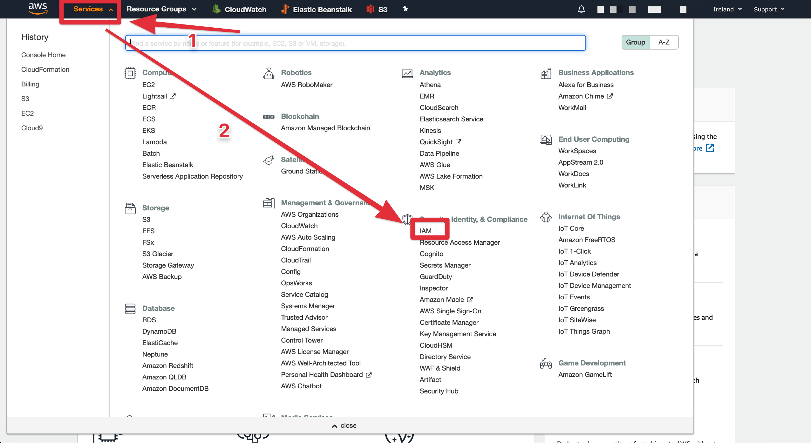
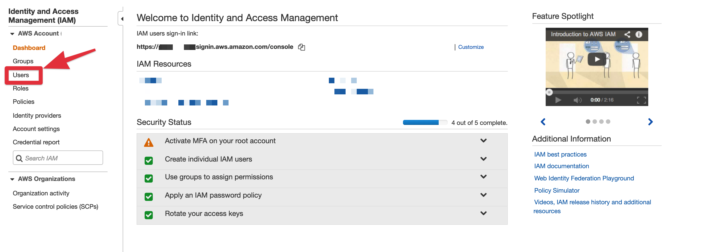
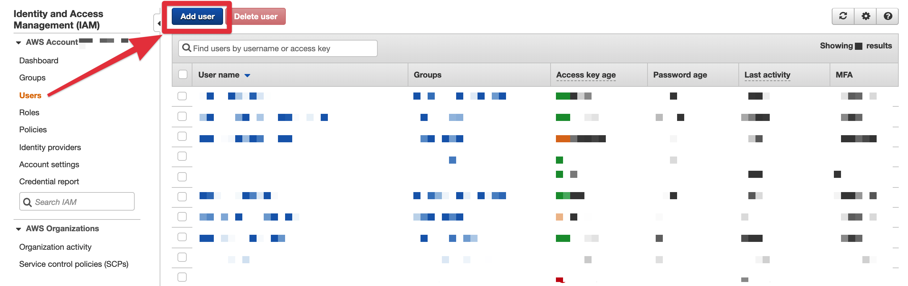
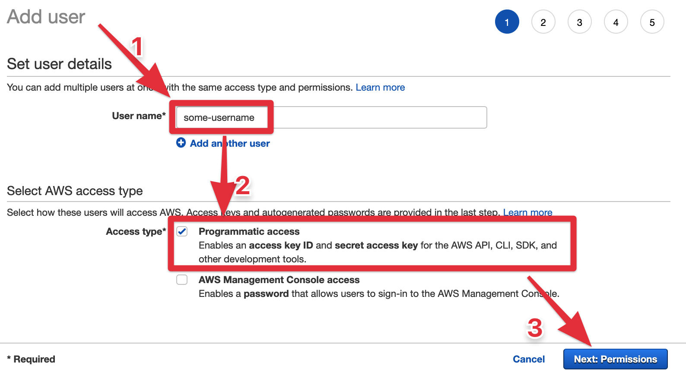
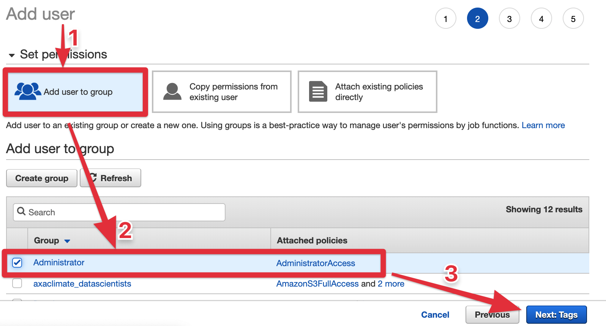
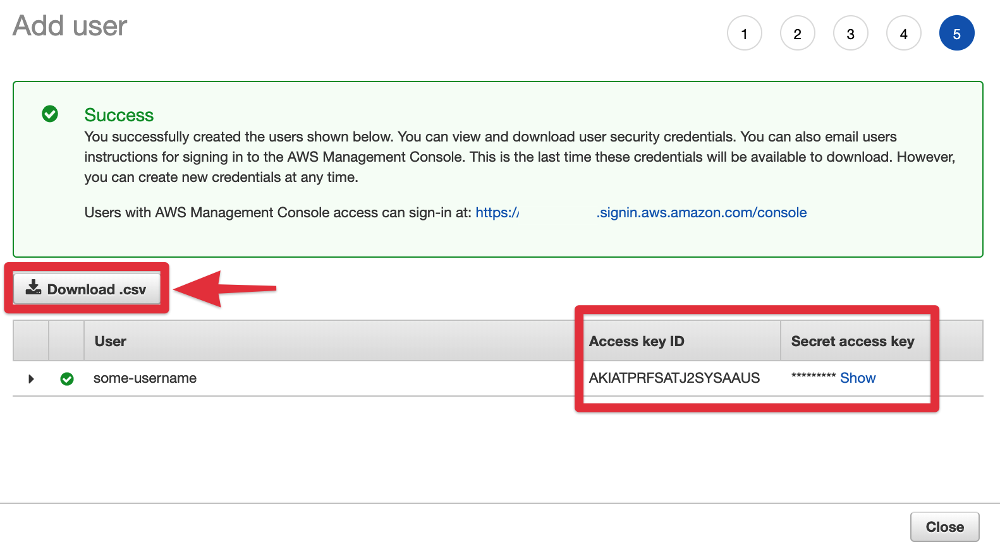

Hello world!

In [part 1](../sailing-with-kuberneters-chapter-1-dockerize-an-app/), we created a basic web app and pushed a Docker image containing the app to Docker Hub.

## 📚 Requirements for part 2

Like in part 1, here is what we need to setup before starting part 2:

- To work with Kubernetes, you must have **`kubectl` installed locally**. This CLI client will help you to define and manage the cluster. [Install it locally](https://kubernetes.io/docs/tasks/tools/install-kubectl/).
- **An AWS account**. Create a free account on [https://aws.amazon.com](https://aws.amazon.com).
- The **`aws` CLI installed locally**. Follow instructions in the [official AWS CLI installation](https://docs.aws.amazon.com/cli/latest/userguide/cli-chap-install.html) page for your operating system.
- **`kops` CLI installed locally**. It will help you define the components of the cluster (machines, networks, roles,... etc). Install it by following [this link](https://github.com/kubernetes/kops/blob/master/docs/install.md).


## 🔧 Setting up AWS

`aws` CLI is required in order to use `kops`. This means that configuring your `aws` locally is the first step.

We first need to give administrative rights to our local `aws` CLI so we can interact freely on our AWS account.

### Create an admin role through the IAM

To do so, access your AWS account on [aws.amazon.com](https://aws.amazon.com), then on the header, click on the mega-dropdown "Services" to list AWS services. Find the **IAM** service in "Security, identity & Compliance" section. IAM stands for _Identity and Access Management_.



Through IAM, we are going to create a user and give it admin rights. AWS will then give us credentials to add locally so any use of the `aws` CLI will use that freshly created admin user.

In the dashboard of IAM, find "Users" in the left panel. Click on it to list already created users, and create a new one.

> Note that in my screenshots, I'm using an AWS account that already has activities. Your screens may be different, but location of links still remain the same.





Give a user name, and tick **Programmatic access** on the access type. This will give our user the rights to access AWS through the CLI.



In the next step, we give our user admin rights. This will help you to freelyl interact with AWS from your console.



You can skip adding tags in the next steps. After confirming details, AWS will provide you credentials of your user. Save the **Access key ID** and the **Secret access key** for later. Ultimately, download the _credentials.csv_ file into a safe location. This file summarize your new admin user details.



### Configure the `aws` CLI locally to use credentials

Now that we have our credentials, and `aws` CLI installed, go to your terminal so we can configure `aws` to use that credentials.

In the terminal type `aws configure`. You will be prompted to add information about the keys you had previousely.


This will store your credentials in a file located in `~/.aws/credentials`. From now, any `aws` command you type will use that credentials. 

### Create an S3 bucket to store the cluster state

`kops` will require a location to store the desired state of the cluster. Because our infrastructure will be in AWS, we use the S3 service to store files describing the target state of the cluster.

We can create a S3 bucket using AWS console (ie UI), but now that you have configured the `aws` CLI, it's good to get you familiarized with it.

> Note that bucket names MUST be unique globally. So even if you create a bucket in a specific locations, say `eu-west-1`, the name must be unique world wide.

To create a bucket, run:

```bash
$ aws s3 mb s3://test-kubernetes-state-b1984 --region eu-west-1
```

## 🏗 Create a Kubernetes cluster on AWS

Time to start working with `kops`...

We are going to build the infrastructure that will include our app. We will provision the master node with 3 app nodes. Machine will be of type `t2.micro`.

> When you create an AWS account, you will be given a 1 year free tier, that includes 720 hours per month of free `t2.micro`. This means that you can run one `t2.micro` machine 24/7 for a year for free. But if you're using several `t2.micro` machines, the total up time of that machines should not exceed 720 hours per month (you'll start paying the exceeding up time).


## 🚀 Deploy the app to the cluster

## 🎛 Change the cluster

## 🛠 Change the application and deploy

## 💥 Destroy the cluster

## 🛍 Take aways

## 👏 Conclusion and next steps
