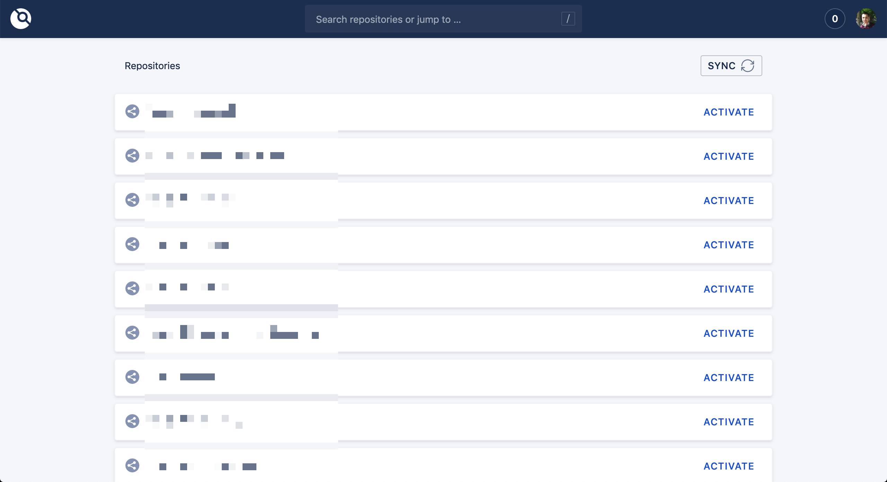

Hello World,

When it comes to create a CI/CD, we developers aren't running out of possibilities. Jenkins paved the road for millions of developers and is the father of all existing CI/CD solutions. Circle-CI is actually having a lot of buzz (and it deserves it!) It's really easy now to have a free CI/CD pipeline to your projects thanks to the native integration of Circle-CI into existing Git repositories (Github and Gitlab being few examples).

It's now 2019 (close to be 2020), and there is no excuse for developers to ignore CI/CD pipelines.

But there is a less known CI/CD solution that I want to share with you in this post and the next one. It's Drone.

But first, what distinguish Drone from other CI/CD solutions?

# Why Drone?

TODO: Explain what is different with Drone compared with other solutions

# The battle plan

We will build a little web app to deploy (in part 2). In part 1, we will setup drone to trigger a CI/CD pipeline when a new push is made on a `master` branch.

To do so, we need to create a Drone agent and host it on the cloud. We will use GCP VM to install Drone. Next we will create an OAuth app in Github and connect it to our VM. This way when our app repo will change, Drone can execute the defined pipeline.

In our example, the web app is build with NodeJS and Express framework, but truly, the CI/CD pipeline is language agnostic.

Also note that I made the decision to use GCP to host our Drone agent and the web app, but here again you're free to use another cloud solution.

# Setting up a GCP Virtual Machine

As said earlier, the first step is to create a VM that will host our Drone agent. This step will be done manually on GCP console, but you can also be done using `gcloud` CLI or Terraform. I just want to move quicker to Drone and skip details of the cloud provider (which will be addressed in future posts).

If not done, create a GCP account, then create a new project where we will deploy our environment (Drone + Web app). A simple googling will help you quick start on GCP.

## Step 1: Create a VM instance


> Don't for get to "Enable billing" on the VM page. If you just created a GCP account, you have $300 credit for the first year, which is enough to get started with this project.

Creating a VM is easy on GCP. Here is a small GIF to illustrate that (beacause we all love GIFs!)


Just make sure:

- You select the region that is close to your location
- You select Ubuntu 18.04 LTS
- You allow HTTP and HTTPS traffic

> In this example, I'm using an `f1-micro` machine just for demo. If you plan to use Drone for all your projects' CI/CD, you should select a better machine.

Once you VM instance is created, note the external IP address. It'll be used later. Let's call this variable `VM_EXTERNAL_IP`.

## Step 2: Configure and prepare the VM instance for Drone

Next, access the VM through SSH using the "SSH" button provided by GCP.


Once in the VM, we perform the classic, yet necessary, machine update/upgrade:

```bash
sudo apt update && sudo apt -y upgrade
```

We then need to install Docker CE. Use `curl` to get the installer, and `bash` to run it.

```bash
curl -L https://get.docker.com | bash
```

Docker is now installed on the machine, but only root user can use it. As said at the end of the installation, if you want to use Docker as non-root user, you must add your user to the Docker group. The necessary command is given, but a generic one can be:

```bash
sudo usermod -aG docker $USER
```

You should now be able to use Docker without prefixing with sudo:

```bash
docker --version
```

> In some cases, we need to `exit` the VM and then connect again with the SSH button to avoid Docker complaining about unauthorized actions (like `docker run`).

# Creating a Github OAuth app

Next, we will configure Github to allow OAuth connexion with Drone. Go to the [Developer Settings page of OAuth](https://github.com/settings/developers), and click on "New OAuth App".

Give the necessary information, like pictured in this screenshot:


Note that for "Homepage URL", I used the format `https://VM_EXTERNAL_IP`, and for "Authorization callback URL", I used the `https://VM_EXTERNAL_IP/login` format.

Register your application, and you'll be given client ID and secret.


Let's call the credential variables `GITHUB_CLIENT_ID` and `GITHUB_CLIENT_SECRET`.

# Deploying Drone into a GCP VM

As said earlier, containers are everywhere in Drone. Even Drone himself is a Docker container.

We start by setting up Drone environment. Do this creating `drone.env` file located in the `/var` folder:

```bash
sudo vim /var/drone.env
```

> PS: If you're not comfortable with `vim`, use `nano`.

Add the following configuration file, replacing `VM_EXTERNAL_IP`, `GITHUB_CLIENT_ID`, and `GITHUB_CLIENT_SECRET` variables with their corresponding values from previous steps.

```
DRONE_SERVER_PROTO=http
DRONE_SERVER_HOST=VM_EXTERNAL_IP
DRONE_GITHUB_SERVER=https://github.com
DRONE_GITHUB_CLIENT_ID=GITHUB_CLIENT_ID
DRONE_GITHUB_CLIENT_SECRET=GITHUB_CLIENT_SECRET
DRONE_RUNNER_CAPACITY=2
```

You can also copy locally my Gist using:

```bash
sudo curl -o /var/drone.env https://gist.githubusercontent.com/htaidirt/794fbd469df38d78dc3c8f6bec8259b6/raw/0491e740c917f05896824194532e7c9d45ae3d4b/drone.env
```

And then edit with `sudo vim /var/drone.env`.

We now can create our Drone container with Docker:

```bash
docker container run \
  --volume=/var/run/docker.sock:/var/run/docker.sock \
  --volume=/var/lib/drone:/data \
  --env-file=/var/drone.env \
  --publish=80:80 \
  --publish=443:443 \
  --restart=always \
  --detach=true \
  --name=drone-demo \
  drone/drone:1
```

This command is pretty straigth forward. We download an image `drone/drone:1` (if not present locally), and start a container with it. We initialize two volumes to get container data persisted in our VM (`/var/run/docker.sock` and `/var/lib/drone` in the VM). We give it the path to the environment variables we created, we publish ports 80 (HTTP) and 443 (HTTPS). We ask it to always restart in case of failure, detach the container, and name it `drone-demo` for future references.

A simple `docker container ls` will prove the existance of the new container. You can also access the logs of the container with:

```bash
docker container logs drone-demo
```

Our Drone container is up and running. We need to access it through the browser and give it access to our Github repositories.

Visit `http://VM_EXTERNAL_IP` and authorize Drone to access information of your Github account:


Once access granted, Drone will sync (can take few seconds), and list our repositories. For our demo, we will create a brand new repository to host our web app.



# Create a test web app

# Test Drone

# Take away for part 1
